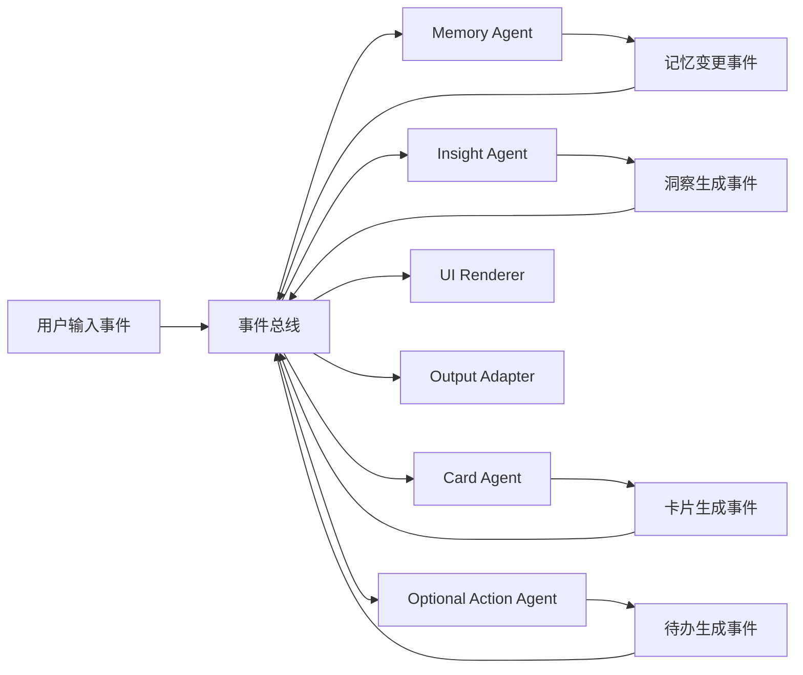

# WideNote / 广记 Project Brief

> 本文档整理自项目启动前的讨论，用于在新项目中延续产品定位、技术原则和关键决策。
>
> 当前工作名：**广记 / WideNote**  
> 当前定位：**本地优先的个人记录、记忆与 Agent 运行时。**

## 1. 背景与出发点

新项目脱胎于现有 Memex 项目的经验，但不是简单 fork。现有项目提供了很多值得参考的方向，例如本地优先、记录入口、Memory、事件驱动 Agent 编排、Skill、洞察、卡片展示等；但也存在迭代效率低、拓展性不足、团队协作不理想等问题。因此新项目希望在理念上继承，在实现上重写，并拥有更自由的架构和社区路线。

项目发起人的真实需求非常明确：

- 每天有大量零碎记录，可能包括心情、想法、灵感、待办、项目上下文、生活事件。
- 需要非常低摩擦地在手机上第一时间输入。
- 需要系统长期记住自己，并从记录中生成洞察。
- 部分情况下需要生成待办、文档、角色卡、外部上下文等，但这些不应绑死为所有用户默认体验。
- 需要一个开放、可拓展、可自部署、可社区共建的个人 Agent 系统。

最终判断是：这个项目不应该只是 AI 日记、PKM、待办工具或 Agent 平台，而应该是以记录为入口、以 Memory 和 Agent 为内核、以开放扩展为上限的个人上下文系统。

## 2. 产品定位

### 2.1 内部定位

**广记 / WideNote 是一个手机优先、本地优先的个人记录与洞察系统。它通过可编排的 Agent，把碎片记录转化成记忆、洞察、行动和外部 AI 可用的个人上下文。**

也可以表述为：

**一个 local-first 的个人上下文运行时：记录是入口，Agent Pack 是处理方式，记忆、洞察、行动和导出是结果。**

### 2.2 对普通用户的表达

普通用户不需要先理解 Agent 编排。对他们来说，产品应该是：

**一个会帮你整理人生碎片的私人记录应用。**

用户只需要知道：

- 我可以快速记录。
- 系统会记住我。
- 系统会帮我整理。
- 系统会生成洞察。
- 我可以选择是否启用待办、文档、外部导出等能力。

### 2.3 对高级用户和社区的表达

高级用户、开发者和社区用户看到的是：

**一个可自由编排的个人 Agent 运行时。**

他们可以：

- 安装 Agent Pack。
- 编写声明式 Agent Pack。
- 编写脚本式 Skill / 插件。
- 订阅事件。
- 触发事件。
- 声明权限。
- 自定义 UI。
- 导入导出个人上下文。
- 连接自部署 Runner 或官方后端。

### 2.4 项目边界

广记不是：

- 纯 AI 日记。
- 纯 PKM 编辑器。
- 纯通用 Agent 平台。
- 纯待办工具。
- 默认全量监控式 lifelog。

广记是：

**以个人记录为入口，以 Agent 编排为机制，以长期个人上下文为资产的本地优先应用。**

## 3. 第一人群

第一目标用户不是所有写日记的人，而是：

**高频记录者 + AI 重度用户 + 有自我整理、创作或执行需求的人。**

典型用户包括：

- 每天有很多碎片想法的人。
- 创作者。
- 开发者。
- 创业者。
- 研究者。
- 独立工作者。
- 强自省用户。
- ADHD / 高敏感 / 强脑内活动用户。
- AI 工具重度用户。
- 愿意尝试插件、Agent Pack、自定义流程的人。

这些用户的共同点：

- 脑子里经常产生想法。
- 不想丢失想法。
- 不愿意手动整理太多。
- 希望系统长期理解自己。
- 希望个人上下文可以被 AI、工具和社区生态复用。

## 4. 用户为什么每天打开

产品的日常打开理由不是“我要写一篇日记”，而是：

**我脑子里刚出现了一个东西，我不想丢。**

典型打开场景：

- 快速记录一个想法。
- 记录情绪或状态。
- 丢进去一个待办。
- 捕获一个灵感。
- 记录一段对话、会议、截图、网页。
- 晚上看今天被整理成了什么。
- 每周看系统发现了什么模式。

产品粘性来自：

- 捕获焦虑。
- 被理解的反馈。
- 长期记忆积累。
- 周期性洞察。
- 个人上下文被外部工具复用。

## 5. 与竞品和相邻品类的关系

### 5.1 AI 日记

AI 日记通常是：

**用户写一段，AI 陪用户反思。**

广记应该是：

**用户持续扔碎片，Agent 把它们变成长期记忆、洞察和行动。**

因此广记可以覆盖情绪记录和自我反思，但不应该主打心理陪伴，也不应该承诺治疗、心理健康改善。

相关产品：

- Rosebud
- Mindsera
- Day One AI
- Apple Journal

### 5.2 PKM / 第二大脑

PKM 通常是：

**用户组织自己的知识。**

广记应该是：

**用户先捕获生活和想法，系统自动组织，并能流向不同知识库。**

因此广记不应该正面替代 Obsidian、Logseq、Anytype、SiYuan、AFFiNE、Capacities、Tana 等，而应该成为它们的上游：

- 手机记录入口。
- AI 整理层。
- Memory 层。
- 导出层。

### 5.3 Agent 平台

Agent 平台通常是：

**用户搭工作流，让 Agent 干活。**

广记应该是：

**用户的个人上下文天然进入 Agent 流水线，普通用户不用搭，高级用户可以改。**

Agent 编排是内核，不是普通用户第一眼看到的东西。

相关产品和生态：

- Dify
- n8n
- Flowise
- LangGraph
- Mastra
- OpenAI Agents SDK

### 5.4 Lifelog / 自动捕获

Lifelog 产品抢的是“自动记录一切”的心智。

相关产品：

- screenpipe
- Omi
- Bee
- Limitless / Rewind 类产品
- OpenRecall

广记可以支持自动捕获类能力，但不应默认成为全量监控产品。短信、通知、屏幕读取、APP 拦截、健康数据、位置轨迹等能力风险较高，适合作为高级插件、社区版能力或 Android 特定能力。

### 5.5 AI 第二大脑 / 个人 AI Memory

这是最需要关注的直接方向。代表产品和项目包括：

- Khoj
- Supermemory
- AnythingLLM
- Reor
- mem0
- Cognee
- Zep / Graphiti
- Letta

这些项目正在定义“个人上下文给 AI 使用”的心智。广记的差异化在于：

- 手机第一入口。
- 高频个人记录。
- 本地强能力。
- 可编排 Agent Pack。
- 可导出到不同圈层和工具。

## 6. 差异化机会

最清晰的差异化不是“再做一个第二大脑”，而是：

**手机优先的个人上下文入口。**

核心差异：

1. 手机强记录入口  
   大多数 PKM 是桌面或编辑器心智，手机只是补充。广记反过来，手机是第一入口。

2. Agent 处理流水线  
   不是写完笔记后问 AI，而是每条记录天然进入事件流，Memory、洞察、待办、文档、导出插件都可以订阅。

3. 个人上下文可移植  
   把个人记忆转化成角色卡、AI memory pack、Obsidian vault、Dify/n8n context、飞书文档等。

4. 本地强能力 + 后端增强  
   没有后端也能用；有后端更可靠、更跨设备、更自动。

5. 社区插件和 Agent Pack  
   爆点能力可以通过插件接入不同小圈子，而不绑架主产品定位。

## 7. 破圈方向

核心市场可能偏小众，因此需要外接到已有小圈子产生传播。

### 7.1 酒馆 / 角色卡圈

将系统对用户的理解转成：

- SillyTavern 角色卡。
- 世界书。
- 长期记忆 prompt。
- AI 角色人格设定。

这不是简单虚拟陪伴，而是更大的方向：

**把个人记忆转换成可携带的 AI 上下文资产。**

### 7.2 Obsidian / Markdown / PKM 圈

把记录自动导出为：

- Markdown vault。
- 双链。
- 每日笔记。
- 主题索引。
- 项目页。
- 周报。

定位上不替代 Obsidian，而是成为手机记录入口和 AI 整理器。

### 7.3 创作者圈

从碎片记录生成：

- 选题。
- 脚本。
- 周报。
- 观点库。
- 素材库。
- 长文草稿。

### 7.4 Agent / 开发者圈

提供：

- Agent Pack。
- 事件订阅。
- Skill。
- 脚本插件。
- 本地/自部署 Runner。
- Agent 运行日志。
- 图形化 Agent 流转。

### 7.5 外部信息聚合

可聚合：

- 飞书。
- 日历。
- 网页分享。
- Telegram / Discord。
- 截图。
- 短信。
- 屏幕内容。

这类能力强，但平台和隐私风险更高，适合作为高级能力。

## 8. 产品能力地图

广记的能力可以分成以下几类：

### 8.1 Capture / Input Adapter

输入能力：

- 文本。
- 语音。
- 图片 / 截图。
- 分享链接。
- 文件。
- 日历。
- 提醒事项。
- 短信。
- 通知。
- 屏幕内容。
- 外部系统数据源。

低风险输入应作为默认核心能力；高风险输入作为高级插件、社区版能力或平台特定能力。

### 8.2 Memory

记忆能力：

- 事实。
- 偏好。
- 目标。
- 项目。
- 关系。
- 用户画像。
- 情绪模式。
- 创作素材。
- 重要上下文。

Memory 是产品灵魂，后续会参考现有 Memex 方案和新代码进一步定义。

### 8.3 Agent / Processor

Agent 负责消费事件、读取 Memory、调用工具、生成新事件。

示例：

- 卡片整理 Agent。
- Memory 提取 Agent。
- 洞察 Agent。
- 待办 Agent。
- 文档 Agent。
- 角色卡 Agent。
- 用户画像 Agent。
- 外部同步 Agent。

### 8.4 Skill / Tool

工具能力：

- 搜索。
- 文件读写。
- 模型调用。
- 时间处理。
- 日历写入。
- 飞书文档写入。
- Obsidian 导出。
- 角色卡导出。
- 外部 API 调用。

Skill 是脚本插件的重要承载方式。

### 8.5 Insight

洞察能力：

- 今日总结。
- 周期复盘。
- 情绪模式。
- 项目状态。
- 行为模式。
- 关系复盘。
- 个人变化。

洞察是核心体验，但应轻主动，不要打扰。

### 8.6 Action

行动能力：

- 待办。
- 提醒。
- 项目推进。
- 文档生成。
- 日程建议。
- 外部执行。

当前决策：**待办 / Action 作为拓展能力，不默认开启。**

### 8.7 UI Renderer

展示能力：

- 时间线。
- 卡片。
- 洞察页。
- Memory 页。
- Agent 运行日志。
- 图形化 Agent 流转。
- 自定义 UI Block。
- WebView / 生成式 UI，社区版或高级模式。

当前决策：**Agent 图形化流转是拓展 / 高级功能，不是默认主界面。**

### 8.8 Output Adapter

输出能力：

- Obsidian / Markdown。
- 飞书文档。
- 酒馆角色卡。
- Dify / n8n context。
- 周报。
- 待办系统。
- JSON / YAML 导出。
- 自定义 API。

### 8.9 Extension / Plugin

扩展能力包括：

- Input Adapter。
- Agent / Processor。
- Skill / Tool。
- Memory Backend。
- UI Renderer。
- Output Adapter。
- Trigger / Scheduler。
- Agent Pack / Workflow Recipe。

## 9. 默认体验

默认体验参考现有 Memex 形态，但要更聚焦。

默认闭环：

**快速记录 -> 时间线 / 卡片 -> Memory -> 洞察**

默认不包含：

- 待办生成。
- 文档生成。
- 外部导出。
- Agent 图形化流转。
- 高风险自动输入。

这些作为官方插件或 Agent Pack 提供。

### 9.1 默认输出形态

倾向：

**先保真保存，再异步整理。**

用户输入一条记录后：

1. 原始记录立刻保存。
2. 时间线立即可见。
3. Agent 异步生成卡片、标签、Memory 候选或轻量洞察。
4. 原文不可被 AI 覆盖或改坏。

### 9.2 洞察频率

倾向：

- 单条记录后：轻反馈。
- 每日 / 每周：生成真正洞察。
- 用户主动问：即时分析。

洞察不要每条都重度打扰。

## 10. 前后端关系

最终平衡原则：

**本地强能力，后端做增强。**

更完整地说：

**客户端拥有数据和即时体验；后端提供可靠性、协同和可选算力；执行位置由任务能力、隐私等级和用户选择共同决定。**

### 10.1 零账号本地模式

无需注册、无需官方后端即可使用。

能力包括：

- 记录。
- 时间线。
- Memory。
- 本地 Agent。
- 本地插件。
- BYOK 调模型。
- 洞察。
- 导出。
- 本地权限控制。

### 10.2 连接模型模式

用户可以在手机上配置第三方模型 API Key。

当前决策：**零账号模式下必须允许配置第三方模型 Key。**

这意味着：

- 用户不需要注册官方账号。
- 不需要官方模型代理。
- 手机可以直接调用模型供应商。
- 本地 Agent 仍然有大量 AI 能力。

### 10.3 静态社区源模式

不需要官方后端也可以有插件源。

可以使用：

- GitHub 仓库。
- 静态 JSON index。
- Release 包。
- 第三方插件源。

官方插件市场不是第一天必须有。

### 10.4 自部署增强模式

用户可以自部署：

- 同步服务。
- 定时调度。
- Runner。
- 私有插件源。
- 长任务执行。
- 私有模型代理。

### 10.5 官方云增强模式

官方后端提供：

- 同步。
- 备份。
- 推送。
- 托管 Runner。
- 官方插件市场。
- 计费。
- 模型代理，可选。
- 远程调度。

官方云不是核心功能的前提。

## 11. 哪些任务在客户端，哪些任务在后端

### 11.1 必须或优先在客户端

- 快速记录。
- 原文保存。
- 离线查看。
- 时间线展示。
- 本地 Memory。
- 本地搜索。
- 本地轻 Agent。
- 用户授权。
- 权限确认。
- 敏感输入捕获，如短信、截图、屏幕、通知。
- 本地插件执行。
- BYOK 模型调用。
- 本地导出。

### 11.2 适合后端增强

- 多设备同步。
- 加密备份。
- 定时任务。
- 周期洞察。
- 长任务。
- 跨设备一致性。
- 推送。
- 插件市场。
- 插件签名与撤回。
- Webhook。
- 公网入口。
- 官方托管 Runner。
- 自部署 Runner。

### 11.3 降级原则

没有后端时：

- 记录必须可用。
- Memory 必须可用。
- 基础洞察必须可用。
- 本地 Agent 必须可用。
- 定时任务可以尽量跑，但不保证可靠。
- 长任务可以受限。
- 多设备同步不可用或需第三方同步方案。

有后端时：

- 定时任务更可靠。
- 多设备同步可用。
- 长任务可转 Runner。
- 外部集成更稳定。
- 推送能力可用。

## 12. 隐私与后端

后端不是“真正的大脑”，也不是唯一数据源。

推荐隐私档位：

| 档位 | 能力 | 服务端看到什么 |
|---|---|---|
| 纯本地 | 记录、Memory、Agent、洞察 | 什么都看不到 |
| 密文同步 | 多设备同步、备份 | 密文和少量元数据 |
| 自部署执行 | 定时任务、远程 Agent | 自己服务器运行时可见明文 |
| 官方普通云执行 | 强 Agent、长任务、集成 | 官方可能看到运行时明文 |
| 官方可信执行环境 | 云执行但尽量不可见明文 | 理论上运营方不可见运行时明文 |

### 12.1 关于“加密 Docker”

普通 Docker 只能隔离进程和文件，不等于服务端看不到数据。

如果要让官方云尽量看不见运行时明文，需要：

- TEE / 机密计算。
- 远程证明。
- 可复现构建。
- 验证 measurement 后释放密钥。
- 每任务临时 Runner。
- 禁止 debug。
- 日志脱敏。
- Egress allowlist。

这属于后期高难度能力，不应作为第一版承诺。

### 12.2 密文同步

当前倾向：**密文同步优先。**

待进一步定义：

- 同步原始记录。
- 同步附件。
- 同步 Memory。
- 同步 Agent Pack 配置。
- 同步插件状态。
- 同步 Agent 输出。
- 是否同步日志。
- 向量索引是同步还是各端重建。

倾向：同步原始数据、Memory、配置、输出结果；索引和缓存各端重建。

## 13. 后端职责

后端主要承担四类事情：

1. 同步 / 备份  
   多设备、加密备份、恢复、附件同步。

2. 可靠调度  
   每日 / 每周洞察、定时检查、推送提醒、周期任务。

3. 远程 Runner  
   长任务、大任务、耗电任务、需要 Webhook / 公网入口的任务。

4. 托管生态  
   官方插件市场、签名、审核、付费、版本兼容、撤回。

后端不应默认承担：

- 保存明文原始记录。
- 作为 Agent 唯一运行位置。
- 要求用户注册才能使用核心功能。
- 强绑定官方插件市场。
- 强迫走官方模型代理。

## 14. Agent 引擎方向

当前判断：

**Agent 引擎的产品内核自己写；具体 Agent 执行框架用适配器接。**

不建议完全照搬某个现成 Agent 框架作为内核。原因是广记的核心不是“跑一个 Agent”，而是：

- 事件驱动。
- Agent 订阅事件。
- Agent 触发事件。
- 本地 / 云端 / 自部署多运行位置。
- 权限隔离。
- Memory 可见可编辑。
- Agent Pack 可安装。
- UI 输出可插拔。
- 任务可恢复。
- 任务可观察。
- 任务可审计。

这些更像产品运行时，而不是单一 Agent 框架能直接解决的问题。

### 14.1 自研部分

需要自研：

- Event 协议。
- Task 协议。
- Agent Pack / Workflow 描述。
- 权限模型。
- Memory 模型。
- Tool Registry。
- Output Event。
- UI Block。
- Trace / 审计日志。
- 本地 runtime。

### 14.2 可适配部分

可以适配：

- 本地 Dart Agent。
- TypeScript Runner。
- Python Runner。
- LangGraph。
- Mastra。
- OpenAI Agents SDK。
- Temporal。
- NATS JetStream。

### 14.3 运行位置

同一套 Agent Pack 语义应支持不同执行位置：

- 手机本地。
- 桌面本地。
- 用户自部署 Runner。
- 官方云 Runner。
- 可信执行环境 Runner，后期。

## 15. 事件驱动设计

事件是第一等公民。

用户输入、记忆变更、Agent 输出、UI 更新、外部导出都应该是事件。

基本模型：

### 15.1 Agent 可以

- 订阅事件。
- 消费事件。
- 读取 Memory。
- 调用 Skill / Tool。
- 生成新事件。
- 输出 UI Block。
- 触发外部输出。

### 15.2 事件可以包括

- 用户输入。
- 卡片创建。
- Memory 更新。
- 洞察生成。
- 待办生成。
- 文档生成。
- 插件安装。
- 权限授权。
- 外部同步。
- 定时触发。

## 16. Agent Pack

Agent Pack 是非常重要的产品抽象。

普通用户看到的是“能力包”或“模式”，而不是复杂的编排图。

高级用户可以看到里面的 Agent、事件、权限和日志。

### 16.1 当前决策

Agent Pack 应该是：

**完整 bundle，一键开启一套能力。**

一个 Pack 可以包含：

- Manifest。
- Agent。
- Prompt。
- Skill / Tool。
- Event subscription。
- Trigger。
- Permission request。
- Memory scope。
- UI block。
- Output adapter。
- 默认设置。
- 版本依赖。
- 示例模板。

### 16.2 示例 Pack

- 默认记录洞察包。
- 待办包。
- 文档包。
- 角色卡导出包。
- Obsidian / Markdown 导出包。
- 飞书同步包。
- 周报包。
- Agent 玩家包。

### 16.3 默认 Pack

默认 Agent Pack 参考现有 Memex 默认链路：

**输入保存 -> 卡片整理 -> Memory 提取 -> 周期洞察**

待办、文档、导出、Agent 图都不默认开启。

## 17. 插件系统

### 17.1 开放程度

当前决策：

- 支持声明式 Agent Pack。
- 支持脚本式插件。
- 不考虑原生插件。

脚本式插件需要支持，因为 Skill 能力需要可扩展。

### 17.2 脚本运行

倾向支持本地运行纯 JS 或受限脚本。

必须有权限分级和授权体系。

可能权限：

- 读 Memory。
- 写 Memory。
- 读记录。
- 写记录。
- 读文件。
- 写文件。
- 联网。
- 调模型。
- 显示 UI。
- 持久化状态。
- 触发事件。
- 调用其他插件。

### 17.3 安全态度

这是 AI 时代，代码透明、用户可以自由选择，安全不能成为封闭借口。

但权限体系仍然必须做：

- 安装时声明权限。
- 运行时敏感权限确认。
- 用户可撤销。
- 插件行为可审计。
- 高风险插件明显提示。

### 17.4 插件市场

当前决策：

- 可以有官方插件源。
- 用户也可以自由选择第三方插件源。
- 早期不一定需要官方后端市场。
- GitHub 仓库 / 静态 JSON 可以作为官方插件市场。

未来官方市场价值：

- 签名。
- 审核。
- 评分。
- 付费。
- 灰度。
- 撤回。
- 兼容性检查。

## 18. UI 插件和生成式 UI

当前决策：

**UI 插件路线要走，并且需要支持比较激进的生成式 UI 尝试。**

但分级：

### 18.1 商店版

更适合：

- 结构化 UI schema。
- 原生组件渲染。
- 安全 UI block。

### 18.2 社区版 / 高级模式

可以支持：

- WebView UI。
- HTML / JS / CSS。
- 动态图表。
- 生成式 UI。
- 更自由的插件界面。

UI 插件影响审核的问题可以放到社区版解决。

## 19. Memory

Memory 是系统记住用户的核心。

当前判断：

- 参考现有 Memex 的 Memory 方案。
- 后续会根据新代码进一步细化。
- Memory 不能只是向量库。

推荐方向：

1. 原始事件  
   用户真实输入和系统事件。

2. 显式 Memory  
   用户可见、可编辑、可删除的记忆。

3. 推断洞察  
   系统生成的模式、画像、趋势，可接受、否认或修正。

需要后续确认的问题：

- Memory 是否用户可见可编辑。
- AI 推断能否直接进入 Memory。
- Memory 是否区分事实、偏好、目标、关系、项目、洞察。
- Memory 是否有置信度。
- Memory 是否记录来源。
- Memory 是否记录更新时间。
- 删除 Memory 后相关 Agent 输出是否失效或重算。

当前倾向：Memory 应该可见、可编辑、可删除。

## 20. 商店版与社区版

当前决策：

**商店版和社区版可以分叉。**

原因：

- 短信读取。
- 通知读取。
- 屏幕读取。
- APP 拦截。
- 脚本插件。
- WebView UI 插件。
- 高风险权限。

这些能力可能影响 App Store / Google Play 审核。

### 20.1 商店版

适合：

- 文本输入。
- 语音。
- 图片 / 截图。
- 分享链接。
- 文件。
- 低风险插件。
- 结构化 UI。
- BYOK。
- 本地 Memory。
- 基础洞察。

### 20.2 社区版

适合：

- 更开放脚本。
- WebView UI 插件。
- 高风险输入源。
- Android 特殊权限。
- 自定义 Runner。
- 未签名插件，需警告。

## 21. 同步模型

当前决策：

**优先密文同步。**

本地优先和隐私路线要求同步层不能默认明文托管。

需要进一步设计：

- 密钥如何生成。
- 多设备如何加入。
- 密钥恢复如何做。
- 附件如何加密。
- 插件状态如何同步。
- Runner 执行是否能接触明文。
- 官方云是否提供普通云执行和隐私执行两档。

倾向：

- 原始数据、Memory、配置、输出结果同步。
- 向量索引、缓存、临时任务状态可各端重建。

## 22. 技术栈初步判断

### 22.1 客户端

推荐：

- Flutter。
- Dart。
- SQLite / Drift。
- 本地事件总线。
- 本地任务队列。
- 本地 Agent runtime。
- 本地插件执行。
- 本地模型 provider 配置。
- 本地权限系统。
- 本地 trace / 日志。

理由：

- 手机第一入口。
- 现有 Memex 技术经验可复用。
- iOS / Android 多端。
- 本地强能力。

### 22.2 后端

推荐：

- TypeScript。
- Fastify 或 NestJS。
- PostgreSQL。
- S3-compatible storage。
- MinIO 用于自部署。
- 早期队列可简单，后期可接 Temporal / NATS JetStream。

倾向：

- Fastify 起步更轻。
- NestJS 适合多人团队和强约束。

后端应做成模块化单体 + 独立 Runner，不要第一天全量微服务。

### 22.3 Runner

Runner 独立于后端 API 进程。

可能有：

- Local Dart Runner。
- TypeScript Runner。
- Python Runner。
- Self-host Runner。
- Official Cloud Runner。
- TEE Runner，后期。

### 22.4 不推荐

- 不推荐 Firebase 作为核心后端，因为自部署和隐私路线不匹配。
- 不推荐把 Supabase 当完整后端命门，可借鉴或局部接入。
- 不推荐把 Dify / n8n 当核心，只适合作为输出或集成目标。
- 不推荐一开始全量微服务。

## 23. 自部署

当前决策：

**支持自部署，全开源。**

自部署不只是隐私口号，而是架构约束。

自部署可以逐步支持：

- 同步服务。
- 备份。
- 定时任务。
- Runner。
- 私有插件源。
- 模型代理。

第一阶段不一定承诺完整官方 SaaS 克隆，但协议和部署方式要为此预留。

## 24. 开源许可证

当前决策：

**AGPLv3 + 商业双授权。**

原因：

- 走社区路线。
- 允许个人使用、自部署、修改。
- 保护社区贡献。
- 对网络服务场景有约束。
- 企业如果想闭源集成、白标、商业发行或规避 AGPL，可以购买商业授权。

理解：

- 代码壁垒在 AI 时代较弱。
- License 主要是表达态度、保护社区和提供商业入口。
- 不指望 license 阻止所有竞品。

建议：

- 核心项目 AGPLv3。
- 官方云、品牌、商标、托管服务另行商业条款。
- 插件可以允许多许可证，但官方收录要声明许可证和权限。

## 25. 命名

### 25.1 中文名

中文名：**广记**

理由：

- 和发起人 ID “广陌” 有关联。
- “广”有广泛、开阔、包容之意。
- “记”直接对应记录和记忆。
- 有文化感，也让人联想到《太平广记》式的万象记录。

缺点：

- 海外用户不自解释。
- 拼音 Guangji 不太好念。
- `guangji.app` 已经有活跃站点。

### 25.2 英文名

英文名暂定：**WideNote**

理由：

- 对应“广记”：wide + note。
- 拼写简单。
- 国际用户能读。
- 和中文名能建立关系。

问题：

- `widenote.com` 已被注册。
- Sharp 历史上有过 WideNote 笔记本产品线，属于轻微撞名。
- note 会把产品心智压到“笔记 App”，需要用副标题拉开边界。

当前策略：

**中文正式名：广记。英文暂用：WideNote。**

对外副标题：

**Local-first personal memory and agent runtime.**

中文副标题：

**本地优先的个人记录、记忆与 Agent 运行时。**

## 26. GitHub 组织与仓库命名

推荐 GitHub 组织：

**widenote**

原因：

- 短。
- 好记。
- 国际用户能理解。
- 和产品名一致。
- `guangji` GitHub 路径已被占。
- `guangji-project`、`widenote-project` 都显得临时或冗余。

推荐主仓库：

**github.com/widenote/widenote**

不建议：

- `widenote-project`
- `guangji-project`

原因：

- `widenote/widenote` 是标准开源主仓库命名。
- `-project` 显得不够正式。
- 后续有 evals、docs、agent-packs 等仓库也不冲突。

未来可能仓库：

- `widenote/widenote`：主项目 / monorepo。
- `widenote/evals`：评估。
- `widenote/docs`：文档。
- `widenote/agent-packs`：官方 Agent Pack。
- `widenote/registry`：插件索引。
- `widenote/website`：官网。
- `widenote/runner`：Runner，若后续拆分。
- `widenote/server`：后端，若后续拆分。

组织内仓库名不需要抢占。真正需要优先抢占的是：

- GitHub org: `widenote`
- 域名：`widenote.ai` / `widenote.app`
- npm scope: `@widenote`
- Docker namespace: `widenote`
- 社交媒体账号名。

## 27. 当前已定决策汇总

1. 项目中文名暂定 **广记**。
2. 英文名暂定 **WideNote**。
3. GitHub 组织建议 `widenote`。
4. 主仓库建议 `widenote/widenote`。
5. 产品定位：手机优先、本地优先的个人记录、记忆与 Agent 运行时。
6. 第一人群：高频记录者 + AI 重度用户 + 有自我整理、创作或执行需求的人。
7. 默认体验：快速记录 -> 时间线 / 卡片 -> Memory -> 洞察。
8. 待办 / Action 是拓展能力，不默认开启。
9. Agent 图形化流转是高级 / 拓展功能。
10. 本地强能力，后端增强。
11. 零账号可用。
12. 零账号模式允许配置第三方模型 API Key。
13. 后端主要用于同步、备份、调度、Runner、托管生态。
14. 支持自部署。
15. 插件市场可官方源 + 第三方源，早期可用 GitHub 静态源。
16. 插件开放声明式 Agent Pack + 脚本式插件。
17. 不考虑原生插件。
18. 脚本插件需要权限分级和授权体系。
19. UI 插件路线要走，生成式 UI 可在社区版 / 高级模式探索。
20. Agent Pack 是完整 bundle，一键开启。
21. Memory 参考现有 Memex 方案，后续结合新代码细化。
22. 同步优先密文同步。
23. 商店版和社区版可以分叉。
24. 开源许可证倾向 AGPLv3 + 商业双授权。
25. Agent Runtime Kernel 自研，外接成熟框架适配器。
26. 客户端技术栈倾向 Flutter + Dart + SQLite / Drift。
27. 后端技术栈倾向 TypeScript + Fastify/NestJS + PostgreSQL。
28. Runner 独立于 API 服务。

## 28. 当前仍待进一步讨论的问题

### 28.1 Memory 详细模型

待根据新代码进一步讨论：

- Memory 数据结构。
- Memory 和事件日志关系。
- Memory 是否区分事实、偏好、目标、项目、关系、洞察。
- Memory 是否有来源、置信度、生命周期。
- 用户如何编辑和删除 Memory。

### 28.2 密文同步设计

待讨论：

- 同步哪些对象。
- 密钥管理。
- 多设备加入。
- 恢复机制。
- 插件状态同步。
- Runner 是否能解密。

### 28.3 脚本插件运行时

待讨论：

- JS 运行时选型。
- 沙箱能力。
- 权限 API。
- 本地和 Runner 是否同构。
- 插件状态存储。

### 28.4 Agent Pack 标准

待讨论：

- Manifest schema。
- 版本依赖。
- 权限声明。
- UI block schema。
- Tool schema。
- 事件 schema。
- Pack 安装、更新、撤回。

### 28.5 后端最小版本

待讨论：

- 第一版是否做官方后端。
- 最小后端只做什么。
- 自部署 compose 包含哪些服务。
- 何时引入 Runner。

### 28.6 商店版策略

待讨论：

- iOS / Android 商店版功能边界。
- 社区版分发方式。
- 高风险权限提示。
- 插件审核策略。

## 29. 建议的新项目第一步

新项目启动时，建议先建立以下文档和骨架：

1. `README.md`  
   写清楚定位：WideNote / 广记，本地优先的个人记录、记忆与 Agent 运行时。

2. `LICENSE`  
   AGPLv3。

3. `docs/product.md`  
   产品定位、用户、默认体验、边界。

4. `docs/architecture.md`  
   local runtime、event、agent pack、memory、runner、backend。

5. `docs/plugin-system.md`  
   Agent Pack、脚本插件、权限、UI block。

6. `docs/privacy.md`  
   本地优先、BYOK、密文同步、自部署、官方云档位。

7. `docs/roadmap.md`  
   不按工时估算，而按依赖关系和能力层推进。

8. `agent-packs/default/`  
   默认记录洞察包的概念草案。

9. `schemas/`  
   Event、Memory、Agent Pack、Permission、UI Block 的 schema 草案。

## 30. 一句话总结

**广记 / WideNote 是一个手机优先、本地优先、开放可扩展的个人上下文系统。用户随手记录，系统通过可编排 Agent 将碎片转化为记忆、洞察、行动和可导出的 AI 上下文；没有后端也能完整可用，有后端则获得同步、调度、长任务和托管生态。**

